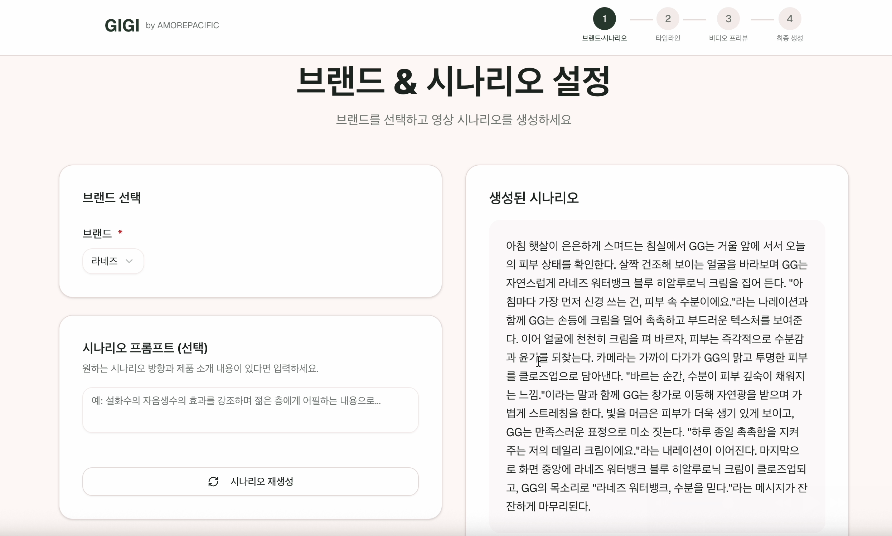
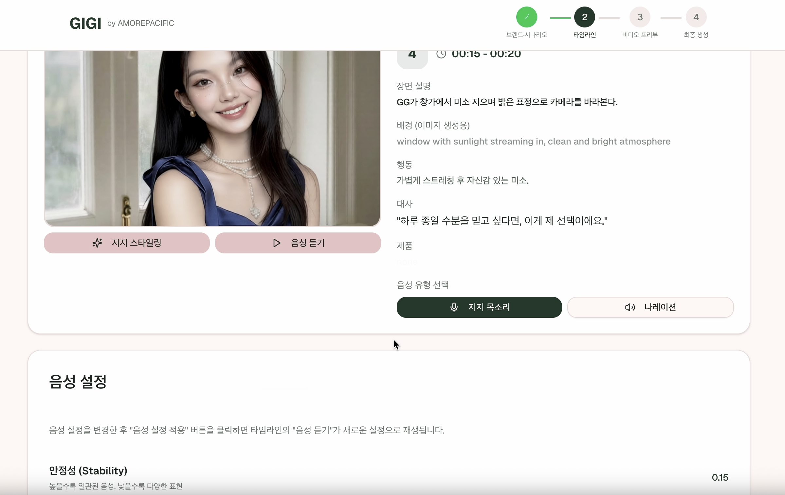
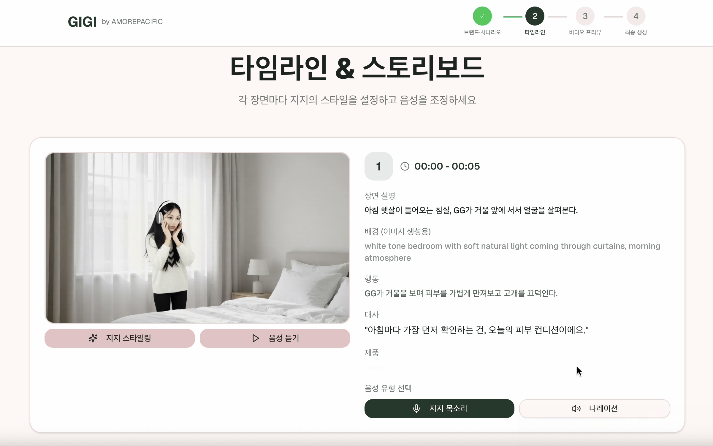
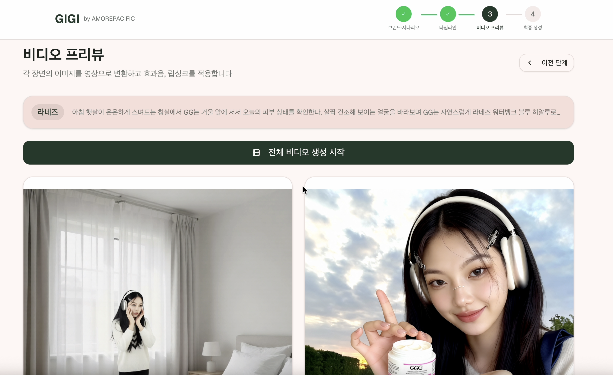

## 아모레퍼시픽 AI 광고 영상 자동 생성 시스템

> 화장품 브랜드 광고 영상을 AI로 자동 생성하는 End-to-End 파이프라인

### 1. 프로젝트 소개

아모레퍼시픽 화장품 브랜드(에뛰드, 라네즈, 설화수, 헤라 등)의 광고 영상을 **텍스트 프롬프트만으로 자동 생성**하는 AI 시스템입니다.

사용자가 브랜드와 광고 컨셉을 입력하면 AI가 `시나리오 작성`부터 `이미지 생성, 영상 변환, 음성 합성, 립싱크, 효과음 추가`까지의 과정을 자동으로 처리하여 완성된 광고 영상을 출력합니다.


### 2. 주요 기능

<table>
  <tr>
    <td width="50%" valign="top">
      <b>1. 시나리오 자동 생성</b><br>
      • <b>EXAONE 3.5</b> LLM 기반 광고 시나리오 작성<br>
      • 브랜드별 맞춤형 스크립트 생성<br>
      • 장면별 타임테이블 자동 분배<br>
      • 스트리밍 방식 실시간 생성
    </td>
    <td width="50%" valign="top">
      <b>2. 음성 합성 (TTS)</b><br>
      • <b>ElevenLabs API</b> 고품질 음성 생성<br>
      • 감정과 톤 조절 가능<br>
      • 광고 나레이션 및 대사 자동 생성
    </td>
  </tr>
  <tr>
    <td width="50%" valign="top">
      <b>3. 이미지 생성 및 편집</b><br>
      • <b>Qwen</b>: 포즈, 표정, 배경 수정<br>
      • <b>Z-Image</b>: 고속 이미지 생성<br>
      • 장면별 스토리보드 자동 생성
    </td>
    <td width="50%" valign="top">
      <b>4. 이미지 → 영상 변환 (I2V)</b><br>
      • <b>Wan2.1 14B</b> 이미지 기반 영상 생성<br>
      • 정적 이미지에 자연스러운 움직임 부여<br>
      • 여러 장면 순차 생성 후 자동 병합
    </td>
  </tr>
  <tr>
    <td width="50%" valign="top">
      <b>5. 립싱크</b><br>
      • <b>LatentSync 1.6</b>: 입 모양 자동 동기화<br>
      • 고품질 립싱크 영상 생성
    </td>
    <td width="50%" valign="top">
      <b>6. 효과음 및 배경음 생성</b><br>
      • <b>MMAudio</b>: 배경음/효과음 자동 생성<br>
      • 텍스트 프롬프트 기반 사운드 생성
    </td>
  </tr>
  <tr>
    <td width="50%" valign="top">
      <b>7. 영상/오디오 병합</b><br>
      • <b>FFmpeg</b> 기반 미디어 처리<br>
      • 여러 영상 클립 순차 연결<br>
      • 음성 + 영상 합성, 오디오 믹싱
    </td>
    <td width="50%" valign="top">
    </td>
  </tr>
</table>


### 3. ComfyUI

이 프로젝트는 **ComfyUI**를 AI 모델 실행 엔진으로 활용합니다. ComfyUI는 노드 기반의 Stable Diffusion 워크플로우 도구로, 복잡한 AI 파이프라인을 시각적으로 구성하고 API로 실행할 수 있습니다. (https://www.comfy.org/)

작동 방식
1. **워크플로우 정의**: 각 AI 기능별로 JSON 형태의 워크플로우 파일 준비
2. **API 요청**: FastAPI 서버가 사용자 입력을 받아 워크플로우 파라미터 업데이트
3. **ComfyUI 실행**: WebSocket으로 ComfyUI 서버에 워크플로우 전송 및 실행
4. **결과 수신**: 생성된 이미지/영상을 ComfyUI에서 다운로드하여 반환

사용되는 주요 모델
| 기능 | 모델 |
|------|------|
| 이미지 편집 | Qwen Image Edit Plus |
| 이미지 생성 | Z-Image Turbo |
| 영상 생성 | Wan2.1 14B I2V |
| 립싱크 | LatentSync 1.6 |
| 효과음 | MMAudio |


### 4. 아키텍처

마이크로서비스 구조로 시스템은 기능별로 독립된 컨테이너로 분리되어 있으며, **Docker Compose**로 통합 관리됩니다.

| 서비스 | 포트 | 설명 |
|--------|------|------|
| scenario-exaone-api | 3000 | 시나리오 생성 (EXAONE) |
| elevenlabs-api | 1100 | 음성 합성 (TTS) |
| video-qwen-api | 4100 | 이미지 편집 |
| zimage-api | 4400 | 이미지 생성 |
| video-i2v-api | 4200 | 이미지→영상 변환 |
| latentsync-api | 2100 | 립싱크 |
| mmaudio-api | 4300 | 효과음 생성 |
| merge-api | 5000 | 영상/오디오 병합 |

세션 기반 파일 공유

서비스 간 파일 공유를 위해 `공유 볼륨(shared_media)`을 사용합니다.

```
세션 폴더 구조:
shared/
└── {session_id}/
    ├── input_image.png    # 원본 이미지
    ├── edited_image.png   # 편집된 이미지
    ├── video.mp4          # 생성된 영상
    ├── audio.mp3          # TTS 음성
    ├── lipsync.mp4        # 립싱크 영상
    └── final.mp4          # 최종 결과물
```

각 서비스는 동일한 `session_id`로 파일에 접근하여 이전 단계의 결과물을 다음 단계의 입력으로 사용합니다.


### 5. 배포

프로덕션 환경에서는 **GHCR(GitHub Container Registry)**에 빌드된 이미지를 사용합니다.

```bash
# 이미지 예시
ghcr.io/amore-gg/amore-ai-scenario-exaone-api:latest
ghcr.io/amore-gg/amore-ai-elevenlabs:latest
ghcr.io/amore-gg/amore-ai-video-qwen:latest
ghcr.io/amore-gg/amore-ai-video-i2v:latest
ghcr.io/amore-gg/amore-ai-latentsync-api:latest
ghcr.io/amore-gg/amore-ai-mmaudio-api:latest
ghcr.io/amore-gg/amore-ai-merge-api:latest
ghcr.io/amore-gg/amore-ai-zimage-api:latest
```


GPU 요구사항

- **시나리오 생성 (EXAONE)**: NVIDIA GPU 필요 (VRAM 16GB+ 권장)
- **ComfyUI 서버**: NVIDIA GPU 필요 (VRAM 24GB+ 권장, 여러 모델 동시 로드)


### 6. 서비스 파이프라인 흐름

```
[사용자 입력: 브랜드 + 컨셉]
         │
         ▼
┌─────────────────────┐
│  시나리오 생성 API    ← EXAONE 3.5
│  (장면/대사/타임테이블)  │
└─────────────────────┘
         │
         ▼
┌─────────────────────┐
│   이미지 생성 API     ← Qwen / Z-Image
│   (장면별 스토리보드)  |
└────────────────────┘
         │
         ▼
┌─────────────────────┐
│     I2V API        ← Wan2.1 14B
│   (이미지→영상 변환)    │
└─────────────────────┘
         │
         ├──────────────────┐
         ▼                  ▼
┌─────────────────┐   ┌─────────────────┐
│   TTS API       │   │  MMAudio API    │
│  (음성 합성)      │   │ (효과음 생성)      │
└─────────────────┘   └─────────────────┘
         │                  │
         ▼                  │
┌─────────────────────┐     │
│   립싱크 API          │     │
│ (음성+영상 동기화)      │     │
└─────────────────────┘     │
         │                  │
         ▼                  ▼
┌─────────────────────────────┐
│         Merge API           │
│  (영상 연결 + 오디오 믹싱)       │
└─────────────────────────────┘
         │
         ▼
    [최종 광고 영상]
```


### 7. 화면

<table>
  <tr>
    <td width="50%">
      
      <p align="center"><em>브랜드별 광고 시나리오 자동 생성 화면</em></p>
    </td>
    <td width="50%">
      
      <p align="center"><em>TTS 음성 합성 및 대사 생성 화면</em></p>
    </td>
  </tr>
  <tr>
    <td width="50%">
      
      <p align="center"><em>장면별 스토리보드 이미지 생성 화면</em></p>
    </td>
    <td width="50%">
      
      <p align="center"><em>이미지→영상 변환 및 최종 결과 화면</em></p>
    </td>
  </tr>
</table>
