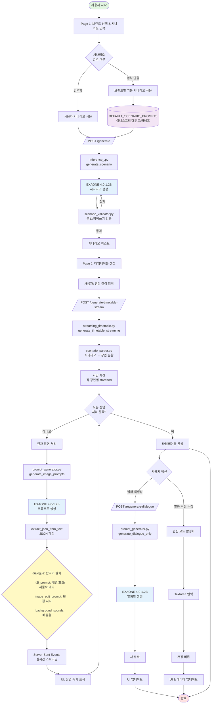
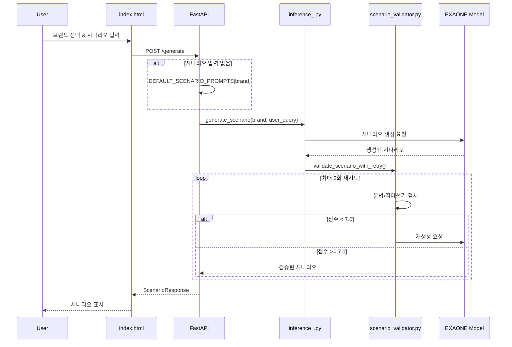
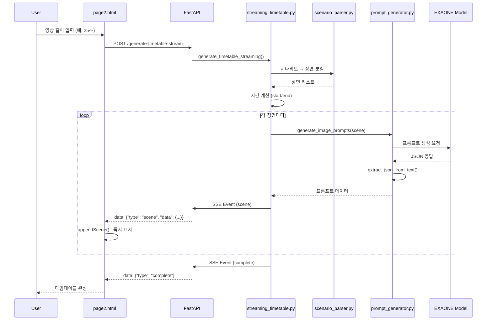
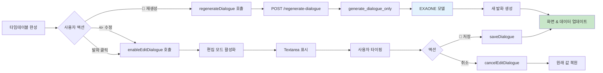

# EXAONE V2 프롬프트 파이프라인

GIGI 가상 인플루언서 광고 영상 생성 시스템의 전체 파이프라인 문서입니다.

---

## 📊 전체 시스템 아키텍처



---

## 🔄 주요 프로세스

### 1️⃣ 시나리오 생성 단계



**핵심 파일:**
- `index.html`: 사용자 입력 UI
- `app.py`: `/generate` API 엔드포인트
- `inference_.py`: EXAONE 모델 호출
- `scenario_validator.py`: 문법/띄어쓰기 검증
- `prompt_generator.py`: `DEFAULT_SCENARIO_PROMPTS` 저장

---

### 2️⃣ 타임테이블 생성 단계 (스트리밍)



**핵심 파일:**
- `page2.html`: 타임테이블 UI & 스트리밍 수신
- `app.py`: `/generate-timetable-stream` API
- `streaming_timetable.py`: SSE 스트리밍 생성
- `scenario_parser.py`: 시나리오 파싱
- `prompt_generator.py`: 프롬프트 생성

---

### 3️⃣ 발화 관리 단계



**핵심 파일:**
- `page2.html`: 발화 편집 UI & JavaScript 함수
- `app.py`: `/regenerate-dialogue` API
- `prompt_generator.py`: `generate_dialogue_only()` 함수

---

## 📁 핵심 파일 구조

| 파일 | 역할 | 주요 함수/API |
|------|------|---------------|
| **index.html** | Page 1: 브랜드 선택 & 시나리오 입력 UI | - |
| **page2.html** | Page 2: 타임테이블 생성 & 발화 편집 UI | `appendScene()`, `regenerateDialogue()`, `enableEditDialogue()`, `saveDialogue()` |
| **app.py** | FastAPI 백엔드 서버 | `POST /generate`, `POST /generate-timetable-stream`, `POST /regenerate-dialogue` |
| **inference_.py** | 시나리오 생성 (EXAONE 호출) | `generate_scenario()`, `load_model()` |
| **scenario_validator.py** | 문법/띄어쓰기 검증 (최대 3회 재시도) | `validate_scenario_with_retry()` |
| **streaming_timetable.py** | 타임테이블 스트리밍 생성 | `generate_timetable_streaming()` (generator) |
| **scenario_parser.py** | 시나리오 → 장면 분할 | `parse_scenario()` |
| **prompt_generator.py** | 프롬프트 & 발화 생성 | `generate_image_prompts()`, `generate_dialogue_only()`, `generate_scenario()`, `DEFAULT_SCENARIO_PROMPTS` |

---

## 🎯 데이터 흐름

### 시나리오 생성
```
사용자 입력/기본값
  ↓
inference_.py → EXAONE → scenario_validator.py
  ↓
검증된 시나리오 텍스트
```

### 타임테이블 생성
```
시나리오 텍스트
  ↓
scenario_parser.py → 장면 분할
  ↓
각 장면마다:
  prompt_generator.py → EXAONE → JSON 파싱
  ↓
  SSE 스트리밍 → UI 즉시 표시
```

### 발화 재생성
```
장면 설명 + 이전 발화들
  ↓
prompt_generator.generate_dialogue_only()
  ↓
EXAONE → 새 발화 → UI 업데이트
```

---

## 🔑 주요 특징

### 1. **스트리밍 방식**
- Server-Sent Events (SSE)를 사용하여 장면을 하나씩 실시간 전송
- 사용자는 기다리지 않고 생성되는 장면을 즉시 확인 가능

### 2. **브랜드별 기본 시나리오**
```python
DEFAULT_SCENARIO_PROMPTS = {
    "이니스프리": "관엽식물이 있는 화이트 + 그린+ 우드 컬러의...",
    "에뛰드": "지지가 전신거울 앞에서 오늘 입은 옷을...",
    "라네즈": "지지가 하얀 배경의 스튜디오 OR 집에서...",
    # ...
}
```

### 3. **발화 이중 관리**
- **AI 재생성**: 버튼 클릭 → API 호출 → EXAONE 생성
- **직접 수정**: Textarea 편집 → 저장 버튼

### 4. **단어 반복 방지**
- 이전 3개 장면의 발화를 참고
- EXAONE에게 다른 표현 사용 지시

### 5. **GIGI 솔로 비디오 강제**
- 모든 장면에서 지지만 등장
- 다른 사람 언급 금지
- 독백 형식 (monologue)

---

## 🚀 실행 흐름 요약

1. **사용자**: 브랜드 선택 (예: 이니스프리)
2. **시스템**: 기본 시나리오 로드 또는 사용자 입력 사용
3. **EXAONE**: 시나리오 생성 → 검증 (최대 3회)
4. **사용자**: 영상 길이 입력 (예: 25초)
5. **시스템**:
   - 시나리오 파싱 → 장면 분할
   - 각 장면마다 EXAONE으로 프롬프트 생성
   - SSE로 실시간 전송 → UI에 즉시 표시
6. **사용자**: 발화 수정 (AI 재생성 또는 직접 타이핑)
7. **완료**: 타임테이블 완성

---

## 📌 API 엔드포인트

| Method | Endpoint | 설명 | Request | Response |
|--------|----------|------|---------|----------|
| POST | `/generate` | 시나리오 생성 | `{brand, user_query}` | `{scenario, brand, query}` |
| POST | `/generate-timetable-stream` | 타임테이블 스트리밍 생성 | `{scenario, video_duration, brand}` | SSE Stream |
| POST | `/regenerate-dialogue` | 발화 재생성 | `{scene_description, previous_dialogues}` | `{status, dialogue}` |
| GET | `/brands` | 브랜드 목록 조회 | - | `{brands: [...]}` |
| GET | `/health` | 서버 상태 확인 | - | `{status: "ok"}` |

---

## 📝 JSON 출력 형식

### 타임테이블 Scene 데이터
```json
{
  "index": 0,
  "time_start": 0.0,
  "time_end": 4.2,
  "scene_description": "지지가 침대에 앉아...",
  "dialogue": "아침 햇살 진짜 좋네요.",
  "background_sounds_prompt": "birds chirping, window opening sound",
  "t2i_prompt": {
    "background": "bedroom with window, morning sunlight streaming in",
    "character_pose_and_gaze": "Gigi standing by window, arms raised",
    "product": "none",
    "camera_angle": "side angle capturing window light"
  },
  "image_edit_prompt": {
    "pose_change": "open curtains and raise arms",
    "gaze_change": "looking out window",
    "expression": "refreshed morning smile",
    "additional_edits": "add sunlight rays"
  }
}
```

---

## 🛠️ 기술 스택

- **Frontend**: HTML, CSS, JavaScript (Vanilla)
- **Backend**: FastAPI (Python)
- **AI Model**: EXAONE 4.0-1.2B
- **Streaming**: Server-Sent Events (SSE)
- **Validation**: 문법/띄어쓰기 검사 (최대 3회 재시도)

---

## 📚 참고

- 모든 발화는 **한국어**로 생성
- 모든 이미지 프롬프트는 **영어**로 생성
- 배경음 프롬프트도 **영어**로 생성
- 지지는 **여성 가상 인플루언서**로 고정
- **솔로 비디오** 형식 (다른 사람 등장 금지)
